# 01_Caso_SmartDesk  
Caso práctico de análisis de bases de datos SQL   

# 1. Análisis de Ventas y Beneficio por Categoría de Producto

La dirección comercial necesita un análisis detallado del desempeño de la cuenta Adabs Entertainment durante el año 2020. Se requiere un desglose completo por categoría de producto que incluya todas las líneas de ingreso (mantenimiento, producto, partes y soporte), las unidades vendidas y el beneficio generado.

[SQL QUERY: RENDIMIENTO DE LA CUENTA DEL CLIENTE ADABS ENTERTAINMENT EN EL AÑO 2020](sql/Query01.sql)

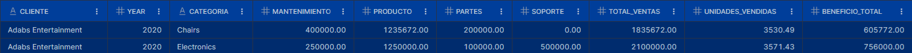

CONCLUSIONES:
De la relación entre el ingreso total (TOTAL_VENTAS) y el beneficio (BENEFICIO_TOTAL) de las ventas de sillas y electrónica a dicho cliente, se aprecia que tienen un rendimiento del 33% y 36% respectivamente, relativamente similar a pesar de tratarse de elementos tan diferentes. Habría que comparar estos rendimientos con los de otros clientes para evaluar si son habituales y/o aceptables.
 

# 2. Comparación de Rendimiento por País en Regiones APAC y EMEA

El departamento de expansión internacional requiere comparar el rendimiento promedio de ventas entre los diferentes países de las regiones APAC y EMEA. Este análisis permitirá identificar mercados con mayor potencial y establecer benchmarks regionales para la toma de decisiones estratégicas.

[SQL QUERY: COMPARACION DE RENDIMIENTO POR PAIS EN LAS REGIONES DE APAC Y EMEA](sql/Query02.sq2)
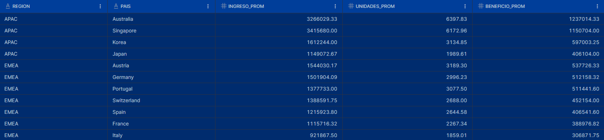

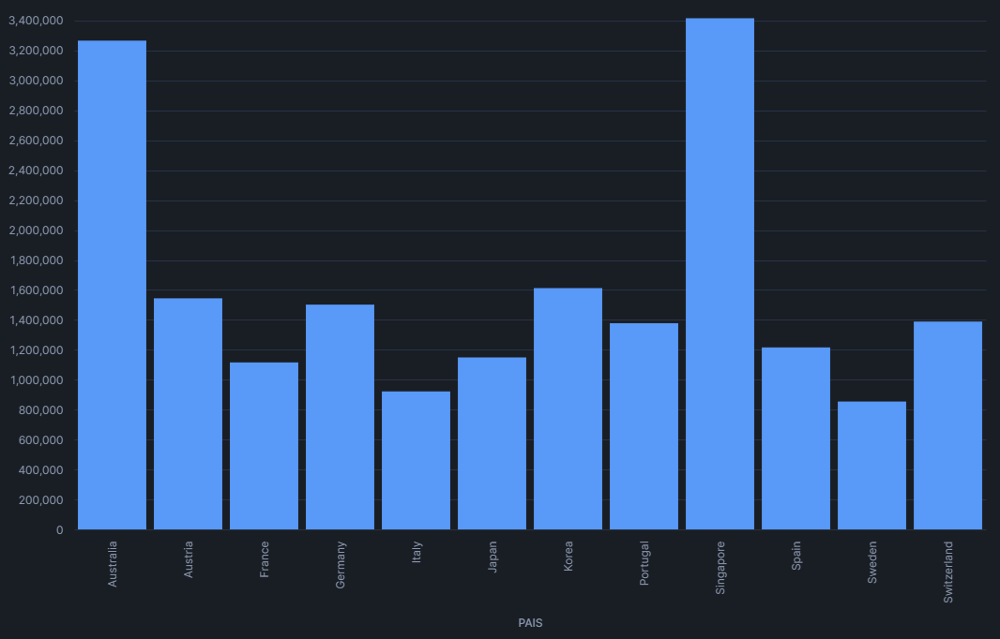

CONCLUSIONES:
Se puede observar que en general los países de la región APAC tienen un ingreso y beneficio considerablemente mayor, destacando Australia y Singapore.

REFLEXIONES ADICIONALES:
A pesar de ser menos países en la región APAC el beneficio total de ambas regiones ronda los 3390000.00, como se puede observar en el resultado de la siguiente consulta:

[SQL QUERY: CONSULTA PARA LA SUMA LOS BENEFICIOS PROMEDIO DE LAS DOS REGIONES, EMEA Y APAC](sql/Query02b.sql)
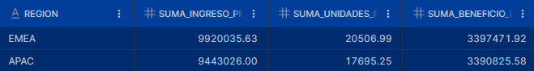
 
COMPROBACIÓN ADICIONAL:
De una consulta exploratoria previa sabemos que en la tabla ACCOUNTS figuran registros de 9 países para la región EMEA, pero en la consulta anterior sólo aparecen 8, el que no aparece es United Kingdom (UK). Comprobamos que efectivamente no hay registros de ventas en la tabla SALES para los 4 clientes registrados de UK.

  
# 3. Análisis del Beneficio Total por Industria: Estudio de Clientes en Etapa de Compromiso

El equipo de ventas estratégicas necesita identificar qué industrias generan mayor beneficio entre las cuentas que se encuentran en etapa Commit (acuerdos cercanos al cierre) y que tienen un pronóstico superior a $500,000. Los resultados deben clasificarse como "Alto" si el beneficio total de la industria supera el $1,000,000, o "Normal" en caso contrario.

[SQL QUERY: ESTUDIO DE INDUSTRIAS GENERAN MAYOR BENEFICIO EN ETAPA DE COMPROMISO "COMMIT"](sql/Query03.sql)

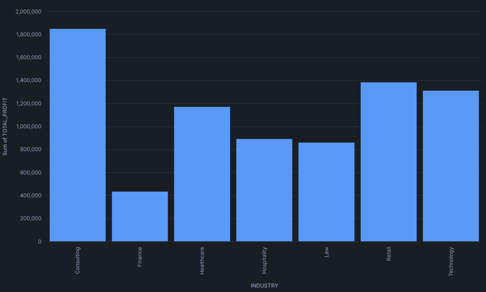
 
CONCLUSIONES:
El sector financiero no está alcanzando el pronóstico superior a 500k. 

# 4. Evolución del Pronóstico y Beneficio Real: Análisis de la Trayectoria por Categoría.

La dirección financiera requiere un análisis consolidado por categoría de producto que compare los beneficios reales totales obtenidos en 2021 con los pronósticos totales para 2022. Adicionalmente, se debe identificar la antigüedad de las oportunidades de venta (más reciente y más antigua) dentro de cada categoría para evaluar la velocidad del ciclo de ventas.Calcula el beneficio de 2021 junto con el pronóstico de beneficio para el año 2022, agrupando los resultados por categoría de producto. Además, queremos identificar la oportunidad más antigua y la más reciente dentro de cada categoría.

[SQL QUERY: EVOLUCION DEL PRONOSTICO Y BENEFICIO REAL: ESTUDIO DE TRAYECTORIA POR CATEGORIA](sql/Query04.sql)
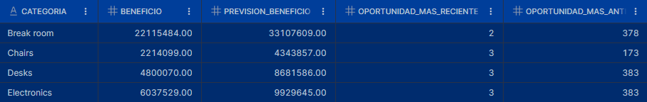

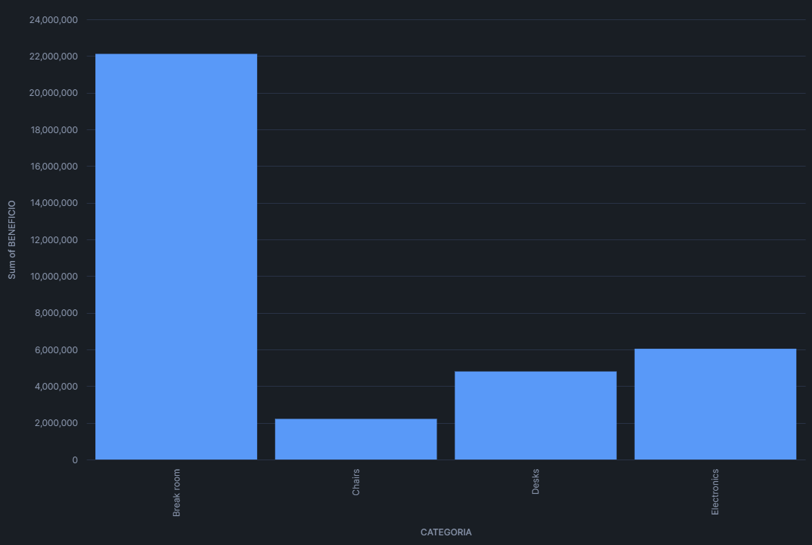
 
CONCLUSIONES:
En las 4 categorías se aprecia que el mínimo de días que ha estado abierta una oportunidad de venta es de apenas 2-3 días, sin embargo puede apreciarse que en 3 de ellas las oportunidades más antiguas superan el año (más de 365 días abierta), de seguir "abiertas" sería conveniente examinar el motivo, y en qué estado realmente se encuentran (tratar de cerrar la venta o darla por no realizada finalmente) a fin de esclarecer el estado real y valorar la situación del stock y medios (repuestos, servicio técnico, o mantenimiento) a disponer en función de la demanda real. 

# 5. CASO PRÁCTICO: ANÁLISIS LIBRE

  1.	INTRODUCCIÓN
La dirección de ventas busca identificar en qué combinación de región e industria la empresa obtiene los mayores y menores beneficios y márgenes.
Este análisis cruzado permite detectar las zonas geográficas y sectores industriales más rentables, optimizando las estrategias comerciales y su asignación de recursos.

  2.	HIPOTESIS INICIAL
Se busca identificar las regiones e industrias mejor y peor posicionadas para realizar una evaluación exhaustiva de ellas, tratar de justificar o corregir las situaciones más desfavorables, así como entender y replicar las estrategias que se estén siguiendo en las regiones e industrias más aventajadas.

  3.	ANALISIS EXPLORATORIO
Para resumir la situación general en las 4 regiones extraemos el beneficio total, mínimo, máximo, promedio, su desviación, y el promedio de los márgenes:

[SQL QUERY: ANALISIS EXPLORATORIO](sql/Query05.sql)
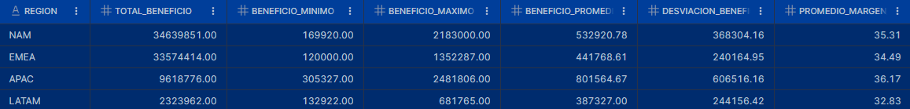

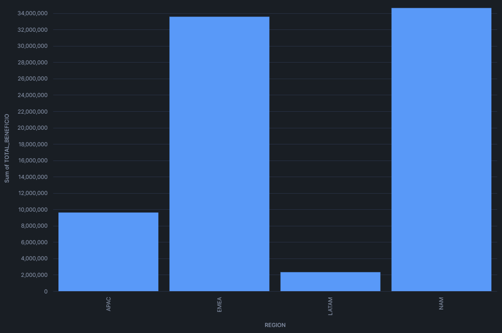

De lo que extremos que la que las regiones que generan mayor beneficio son NAM y EMEA, y la que menos por mucho LATAM, sin embargo, los márgenes promedio no difieren tanto entre estás regiones. Dicha diferencia puede deberse a varios factores, desde la diferencia de territorio o población hasta la falta de mercado en la región (posible predominio de zonas rurales, etc.).

Con la siguiente consulta, podemos identificar cuales son las industrias con mayor y menor margen de beneficio en cada región. Se ha asignado la etiqueta RENDIMIENTO en función de los márgenes para cada industria según el siguiente criterio:
-	Margen > 38%			        ->	Alto
-	Margen entre el 38 y 33% 	->	Medio
-	Margen < 33%			        -> 	Bajo

[SQL QUERY: ORDENADO POR MARGEN EN CADA REGION](sql/Query05b.sql)
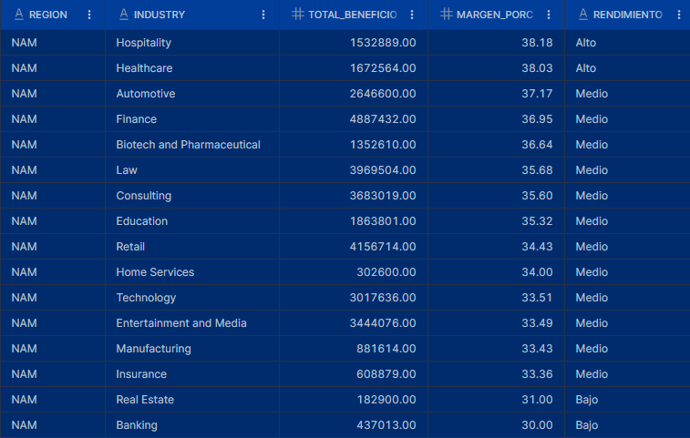

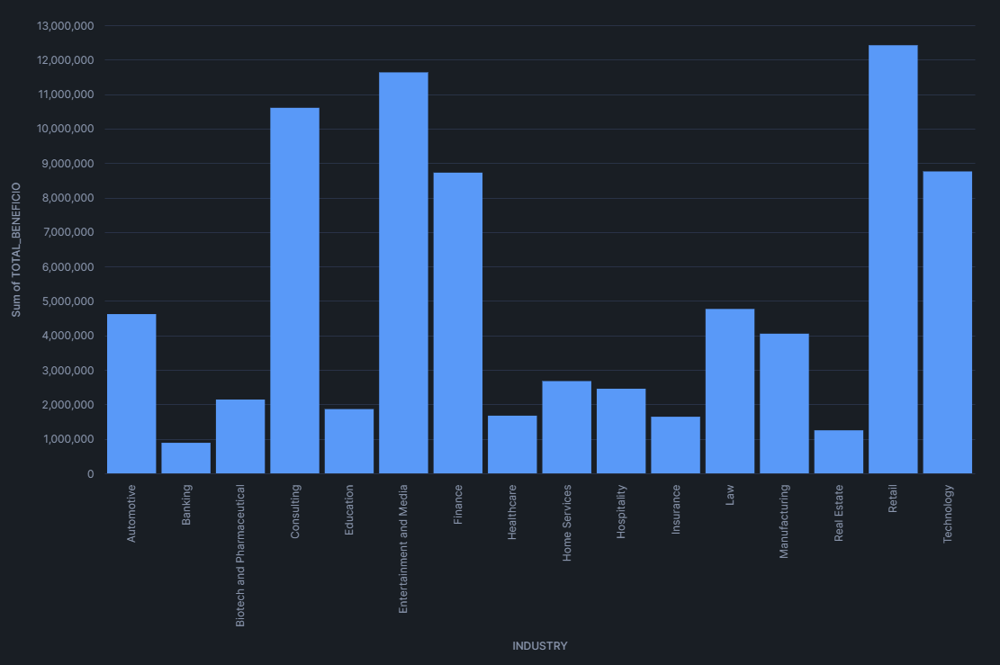

 
  4.	RESPUESTAS A LA PREGUNTA DE NEGOCIO

Los resultados obtenidos muestran que las regiones NAM (Norteamérica) y EMEA (Europa, Medio Oriente y África) concentran los mayores beneficios totales, mientras que LATAM (Latinoamérica) presenta una brecha significativa respecto al resto.

Sin embargo, al analizar los márgenes promedio de beneficio, se observa que las diferencias porcentuales entre regiones son menores, lo que sugiere que la rentabilidad relativa es más homogénea, aunque el volumen de negocio no lo sea.

Estos hallazgos indican que el desempeño regional no depende solo del tamaño del mercado, sino también de la composición industrial dominante en cada región y su nivel de madurez comercial.
Por ejemplo, una región con industrias de márgenes altos, aunque tenga menos volumen, puede ser tan o más rentable que otra con mayores ventas, pero baja eficiencia.

  5.	REFLEXIÓN Y SUGERENCIA DE ESTRATEGIA

a)	Reforzar las industrias de margen alto en regiones emergentes (LATAM y APAC):
Replicar el modelo operativo de sectores rentables (como Tecnología o Servicios Financieros) en regiones de menor volumen puede acelerar la rentabilidad global.

b)	Optimizar sectores de margen medio-bajo:
Analizar los costos y políticas de precios en industrias con márgenes <33% para elevar su eficiencia y contribuir al beneficio total.

c)	Priorización de inversión regional:
Concentrar los esfuerzos comerciales y presupuestarios en NAM y EMEA para sostener su crecimiento, mientras se diseñan estrategias de expansión escalonada en LATAM.

d)	Seguimiento con dashboards dinámicos:
Mantener el monitoreo del beneficio total, margen promedio y su desviación por región e industria, utilizando vistas como BENEF_MARGE_REG para detectar rápidamente desviaciones o nuevas oportunidades.

